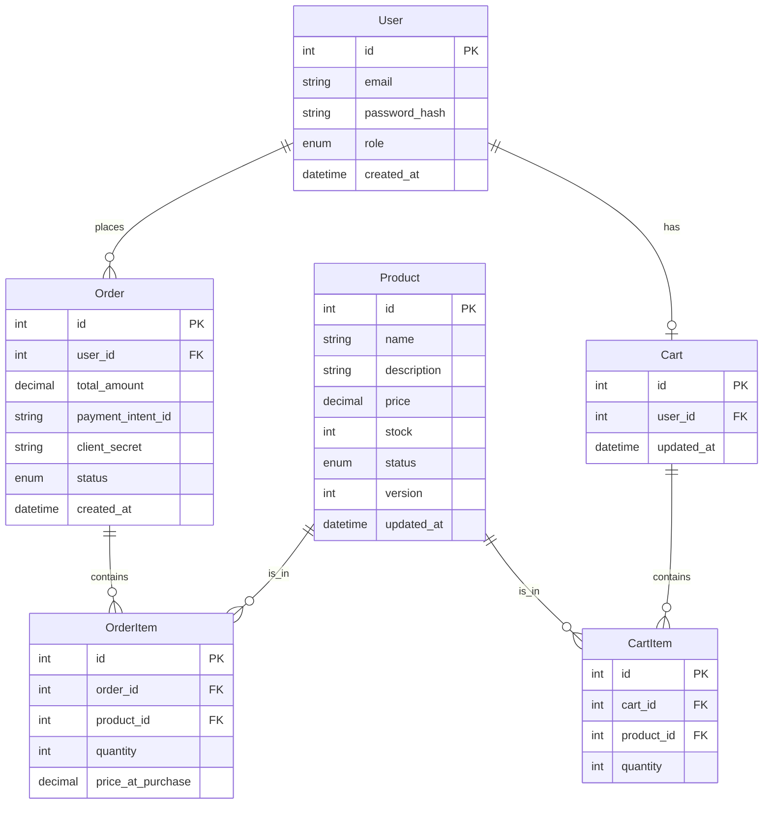

# Mini E-Commerce API

A backend system designed to simulate a basic online shopping platform. This project focuses on authentication, role-based access control, product management, cart operations, and order processing while ensuring proper business logic and data consistency.

## Live API Deployment

> [Link to Live API Deployment Placeholder]

## Tech Stack

- **Framework:** [NestJS](https://nestjs.com/) (Node.js)
- **Language:** TypeScript
- **Database:** PostgreSQL
- **ORM:** TypeORM
- **Authentication:** Passport & JWT (JSON Web Tokens)
- **Validation:** class-validator
- **Package Manager:** pnpm

## API Documentation

Comprehensive interactive API documentation is available via Swagger/OpenAPI:

- **Swagger UI:** http://localhost:5000/api/docs (when running locally)

## Setup Instructions

### Prerequisites

- Node.js (v16+)
- PostgreSQL
- pnpm

### Installation

1. Clone the repository:

   ```bash
   git clone <repository-url>
   cd mini-ecommerce-api
   ```

2. Install dependencies:

   ```bash
   pnpm install
   ```

3. Environment Configuration:
   Create a `.env` file in the root directory and configure your database credentials and JWT secret.

   ```env
   DB_HOST=localhost
   DB_PORT=5432
   DB_USERNAME=postgres
   DB_PASSWORD=yourpassword
   DB_NAME=mini_ecommerce
   JWT_SECRET=yoursecretkey
   ```

4. Run the application:
   ```bash
   # development mode
   pnpm run start:dev
   ```

## Database Schema

The database schema is designed to ensure data integrity and support transaction-based operations.



## Key Architectural Decisions

1.  **Atomic Transactions for Orders**:
    - To prevent overselling (race conditions), order placement wraps inventory deduction and order creation in a single database transaction.
    - Used Pessimistic Locking (or safe atomic updates) to ensure stock doesn't drop below zero.

2.  **Snapshotting Pricing**:
    - Prices in `OrderItems` are snapshots of the product price at the time of purchase. This ensures that future changes to product prices do not affect historical order data.

3.  **Persistent Cart**:
    - The Cart is modeled as a persistent database entity linked 1-to-1 with the `User`. This allows the cart state to persist across sessions and devices/browsers.

4.  **Calculated Totals**:
    - All financial calculations (e.g., Order Total) are performed strictly on the backend using the database's product information, ignoring any prices sent from the client to prevent manipulation.

5.  **Role-Based Access Control (RBAC)**:
    - Custom Guards and Decorators (`@Roles`, `@CurrentUser`) separate concerns between Admin (Product Management) and Customer (Shopping) features.

## Assumptions Made

- **Currency**: All prices are assumed to be in a single currency (e.g., USD) for simplicity.
- **Payment Flow**: Actual payment gateway integration is out of scope. The "Place Order" action assumes payment is successful or handles it as a distinct "Pending" state.
- **Inventory**: Stock is deducted immediately upon order placement ("Inventory Locking").
- **Single Cart**: A user has only one active cart. Adding an item to the cart checks if a cart exists; if not, it creates one.
- **Soft Deletes**: Products are soft-deleted (`status = 'deleted'`) rather than removed from the database to preserve referential integrity for historical orders.
